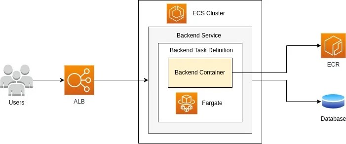

# Overview

Elastic Container Service (ECS) is a lightweight container orchestration system.
Much simpler than [Kubernetes (EKS)](./elastic-kubernetes-service.md), ECS
enables you to host containers leveraging the FARGATE platform for easy
deployment and automatic resiliency.

## Prerequisites

### Subnets for Zone Redundancy

You'll want to first create a pair of subnets in the VPC of your choice to
handle the availability options for your ECS cluster. These can be small,
depending on how many replicas you need, but you'll want at least two of them,
in two different availability zones (`us-west-2a`/`us-west-2b`). See our
[subnets guide](../networking/subnets.md) on how to set these up.

### Application Load Balancer

You'll want to pre-create an Application Load Balancer (ALB) if you don't want
to expose your containers directly to the internet. You'll attach your ECS
service to this ALB. See our
[Application Load Balancer guide](../networking/application-load-balancer.md)
for more information.

### Security Group for Firewall

You'll want to pre-create a security group specific to your application's
incoming port needs. You can

## Creating your Elastic Container Service

ECS works by first configuring a **cluster**, then you'll register a **service**
in that cluster to run your container in a variety of ways.

### Creating the Cluster

In the AWS portal, search for **Elastic Container Service** and open that app.
You'll be presented with a list of clusters. Click **Create cluster** at the top
right.

Provide a **Cluster name** and leave the rest default.

Back at the list of clusters, click on your new cluster to be presented with the
cluster dashboard.

### Creating the Task definition

You can think of the task definition as a manifest for **how** your service
should run.

At the top right, click **Create new task definition**.

Give it a **Task definition family** name, adjust and of the **Task size**
parameters like **CPU** or **Memory**, then in the **Task execution role**
field, if you don't already have one, click the dropdown and select **Create new
role**.

In the container section, you'll give your container a **Name**, the **ECR_URI**
we configured in the
[Elastic Container Registry guide](./elastic-container-registry.md).

Don't worry about enabling **Private registry authentication**, the previous
**Task execution role** should allow ECS to pull image from your ECR.

On my app, it listens on port `8080`, so I'll change the **Container port** to
that.

You can adjust resource allocation limits if you need.

I like to leave the log collection as the defaults. It's nice to get my
container logs in CloudWatch.

You might want to configure a **Restart policy**, it's as simple as checking the
**Enable Restart policy** toggle button.

For storage, I need to mount a persistent volume at `/myapp/data`, so I'll click
the **Add volume** button. give it a name like **myapp_data**, leaving the rest
default. Now click **Add mount point**, select your container from the dropdown,
then in my case, I'll use `/myapp/data` in the **Container path** field.

Finally, click **Create**.

### Creating the Cluster Service

Next, you'll want to create a new **service** for your cluster. Click the
**Create** button on the top right of the services pane.

There's a lot of options here, and it's good to investigate them all. For the
purpose of this guide, I want the following architecture:

In the compute configuration section we will keep it set to **Capacity provider
strategy**, using the default capacity provider of **FARGATE**.

Under the deployment configuration block, we'll use the application type
**Service**, to indicate that this is a service we want running at all times,
unlike a **Task** which runs once and stops. The **Family** will be the name of
the task definition family you previously created and the **Service name** can
be whatever you'd like.

In the Networking block, I'll configure mine to live in my default VPC and
select the two subnets I created in the [Prerequisites](#prerequisites) section.

Select the security group you created that allows traffic from your Application
Load Balancer (TODO), and disable **Public IP**, as we're going to connect this
behind the ALB.

Expand the **Load balancing** box and check the **Use load balancing** checkbox.
Check the **Use an existing load balancer** radio box and select the ALB you
created from the dropdown. Select the **Use an existing listener** and select
the available listener. Select **Use an existing target group** and select the
target group you created.

Finally, at the bottom, click the **Create** button.

(TODO) iron out the security group settings to allow traffic from the ALB to the
app.

(TODO) figure out how to do HTTPS redirects in the UI
